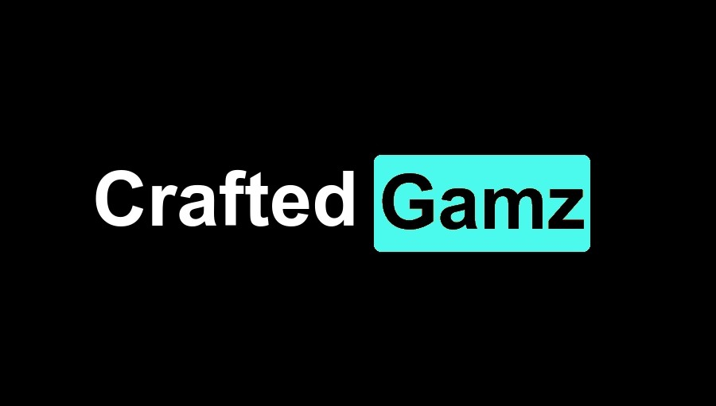
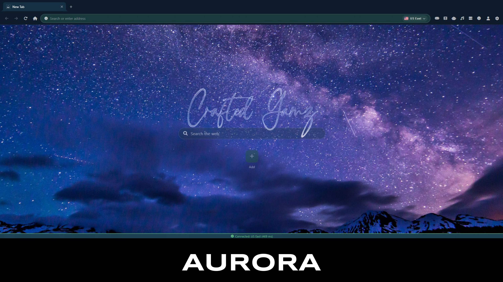
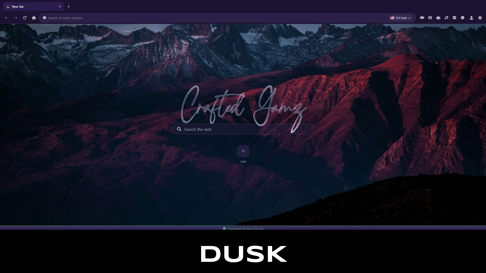
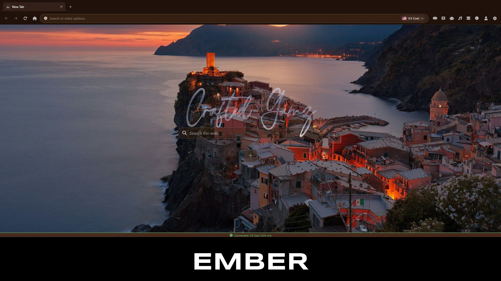
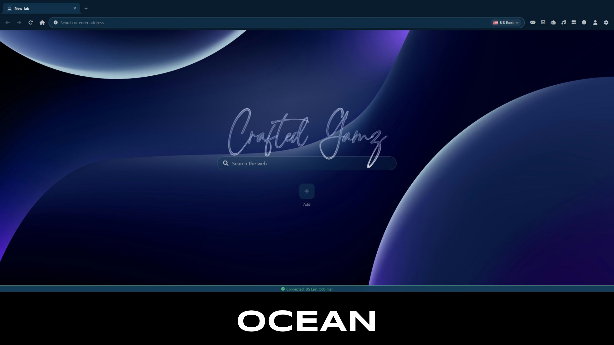
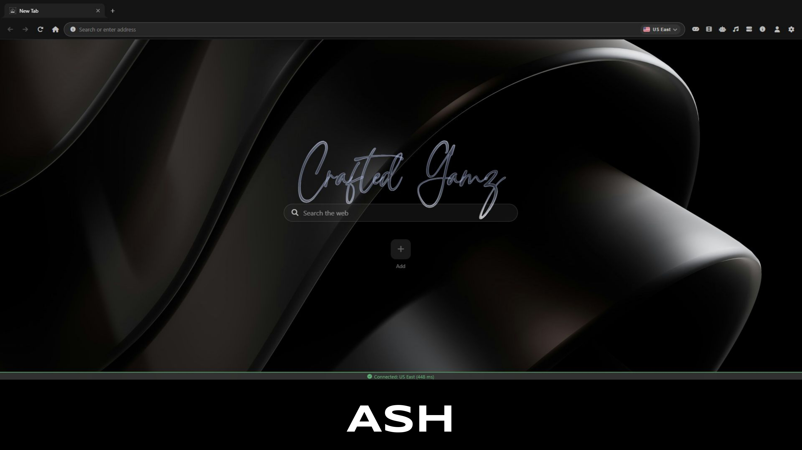
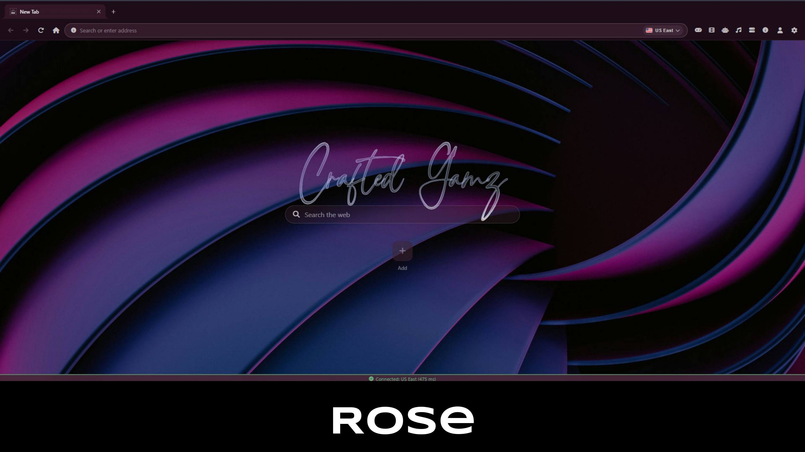
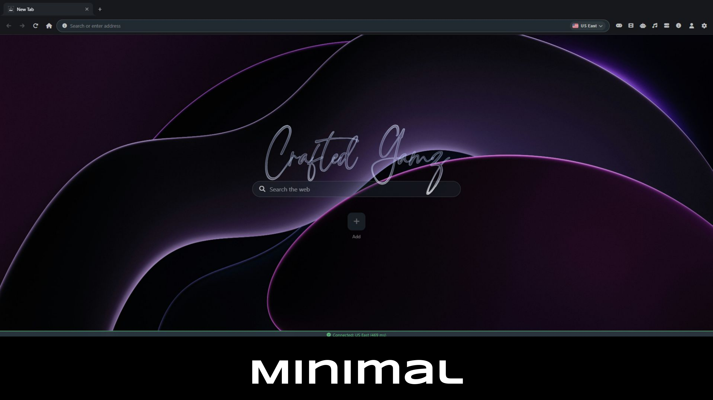

# Crafted Gamz

Crafted Gamz is a multi-mode browser platform that blends classic unblocked-games energy with a full proxy toolkit, account features, AI, apps, media, and even a desktop-style environment.

At its core, it is built to give people one place where they can play, browse, install, personalize, and come back to a space that still feels like theirs.

## Accounts Make It Personal

Crafted Gamz is not just a disposable site you visit once and leave behind. It has real account support built into the experience.

Users can sign in with:

- Google
- GitHub
- Email and password

Accounts are there to make Crafted Gamz feel persistent. Depending on the mode, signing in can save and sync things like:

- your preferred environment
- onboarding progress
- bookmarks
- pins
- open tabs
- settings and local preferences
- app and desktop-related state

There is also guest access for people who want to jump in quickly, but the full experience is clearly designed around having a returning identity and cloud-synced continuity.

## The Three Modes

Crafted Gamz is built around three distinct ways to use it. Each one has its own personality.

### Desktop

Desktop mode is the most ambitious part of Crafted Gamz. It feels like a browser-native mini operating system with strong macOS-style energy.

You get:

- a desktop layout with windows
- a dock for pinned and running apps
- a launcher for opening everything quickly
- an app store for browsing and installing apps
- installable game, internet, and utility apps
- fullscreen, minimize, restore, and multi-window behavior
- top-bar widgets like account info, stats, network status, and weather

It is not just a themed page. It is trying to feel like its own environment.

One of the standout features is the built-in AI assistant, which works a lot like a lightweight Jarvis for the desktop. It can help with normal conversation, but it is also wired into the system itself. It can do things like:

- list installed apps
- fetch available apps from the store
- install apps
- open apps
- close and minimize windows
- pin and unpin apps
- open settings or the app store
- help manage the desktop without making the user dig through menus

That makes desktop mode feel more alive than a normal launcher. It is the mode that turns Crafted Gamz from a site into a space.

### Website

Website mode is the classic Crafted Gamz experience. This is the one that feels closest to a traditional unblocked games and proxy site, just with a much broader feature set than most.

This mode includes:

- the main home page
- a large browser game library
- app shortcuts and wrappers
- AI chat
- music and movies pages
- virtual machine pages
- a search/proxy section
- platform stats and top-game tracking

It is the easiest mode to understand immediately. If someone wants the familiar UBG-and-proxy vibe, this is it. You land, pick a game, open an app, search the web, or launch one of the extra tools and just go.

What makes it stand out is that it does not stop at being a simple game directory. It mixes classic game-site convenience with account-backed features, media sections, AI, and built-in proxy access.

### Browser

Browser mode turns Crafted Gamz into its own proxy browser environment.

Instead of just giving you a single search box, it gives you a full browser shell with:

- tabs
- back and forward navigation
- reload and home controls
- a real address bar
- bookmark support
- a bookmarks bar
- account and settings pages
- connection details
- server and region switching
- local internal pages through `cg://` shortcuts
- theme switching with dark and light modes
- background presets like Minimal, Aurora, Dusk, Ember, Ocean, Ash, and Rose

The internal browser pages cover areas like:

- games
- movies
- AI
- music
- VMs
- about
- settings
- account

This mode is especially strong because it keeps the proxy experience feeling like a real environment instead of a one-off utility. It also syncs important browser state through accounts, including bookmarks, pins, and even saved tabs.

For people who want Crafted Gamz to feel like their actual browsing workspace, browser mode is the clearest expression of that idea.

The browser also has its own visual identity system. You can switch between dark and light themes, then layer that with different background presets to change the mood of the whole environment.

## Proxy Features

Proxy access is a major part of Crafted Gamz's identity.

Across the project, the platform supports proxy-focused browsing through:

- Ultraviolet
- Scramjet
- Wisp-backed connections
- a dedicated proxy search flow
- the full browser-mode proxy environment

That means Crafted Gamz is not only about games. It is also about making the web more reachable from inside the platform itself.

## More Than A Game Site

A lot of people would probably first describe Crafted Gamz as a games site, and that is fair, because games are still a big part of it. There are more than one hundred game pages mirrored across the project, plus app wrappers, media sections, AI tools, and installable desktop content.

But the reason the project feels different is that it keeps pushing beyond that label.

It is:

- part classic unblocked-games hub
- part proxy platform
- part custom browser
- part browser desktop
- part personal web space

That combination is what gives Crafted Gamz its identity.

## Why It Stands Out

- It has accounts, so the experience can actually persist.
- It gives users three different ways to use the platform instead of one flat interface.
- Desktop mode feels surprisingly close to a lightweight browser OS.
- Browser mode is a real proxy browsing environment, not just a launcher.
- Website mode keeps the fast, familiar UBG/proxy feel people already understand.
- AI is woven into the experience instead of being bolted on as a novelty.

## In Short

Crafted Gamz is a platform with memory.

You can sign in, choose your mode, save your space, browse through a proxy, install apps on a desktop-like shell, use a Jarvis-style assistant, and still drop back into the classic game-site experience whenever you want.

That is what makes it more than just another browser games site.
